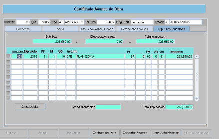

## README
#### RM 117065
#### Discrepancias entre Saldos iniciales y saldos finales por beneficiarios

---
* Se desarrollo un Script en python para:
  * Analisis y reconocimiento de las anomalias
  * exportacion de los resultados por:
    * Año por hoja
    * Resumen en una hoja al inicio que involucra:
      1. cantidad de benificiarios con anomalias por año
      2. cantidad de anomalias por tipo de formulario por año
      3. cantidad de tipo de anomalias por año
         * FH_IMPUTACIONES: La columna corresponde a la fecha que valida y tiene que corresponder el año con el ejercicio. 
         * NEW_FH_IMPUTACIONES: Columna que corresponde en el sistema de SIGAF cuando visualiza la fecha de Imputacion (e.g grafico)
         * 